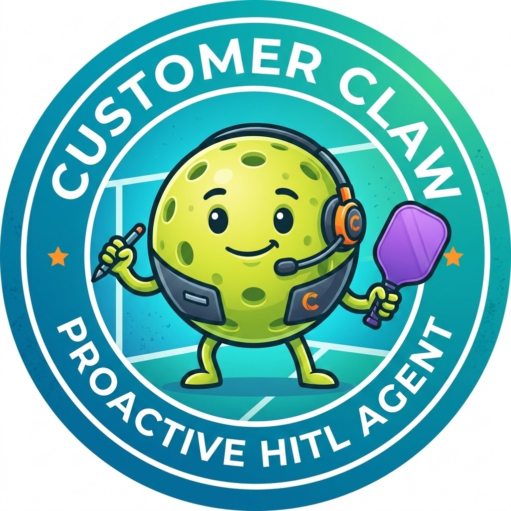

<p align="center">
  
</p>

<h1 align="center">CustomerClaw</h1>

<p align="center">
  Proactive, Human-in-the-Loop customer experience agent.<br>
  Finds problems before customers do — and won't act without your say-so.
</p>

---

## What it does

- **Proactive outreach** — Cron jobs scan for stale orders and have the agent draft customer messages automatically. Operators configure rules in plain English.
- **Human-gated actions** — Destructive operations (refunds) pause for operator approval. TOCTOU double-validation prevents race conditions between approval and execution.
- **Reactive support** — Handles inbound customer chats through the same agent loop, with order lookup and refund tools.
- **Full audit trail** — Every LLM call, tool execution, and approval decision is persisted and visible in a real-time event log.

## Architecture

```
Operator Dashboard (Jinja2 + HTMX)
         │
         ▼
   FastAPI (REST + SSE)
         │
         ▼
   Agent Orchestrator ◄──── CRM Poller (APScheduler)
   ├── LLM (OpenRouter)          ├── Cron jobs from Rules AI
   ├── Safe tools → execute      └── Synthetic sessions for stale orders
   └── Dangerous tools → HITL gate
         │
         ▼
   SQLite (sessions · orders · events · actions)
```

## Key design decisions

- **No agent framework** — The orchestrator is a ~40-line `while` loop with three explicit code paths: safe tool → execute, dangerous tool → pause, stop → reply. Every state transition is a single `if/elif/else`.
- **Graph-enforced state machine** — Order status transitions are governed by a directed graph. Illegal transitions (double-refund, refund-after-cancel) are structurally impossible at the data layer.
- **TOCTOU double-validation** — Refunds are validated before showing the approval card *and* again when the operator clicks Grant, catching state drift during the approval window.
- **Server-rendered UI** — HTMX swaps server-rendered HTML fragments. No React, no Vue, no client-side state.

## Tech stack

| Layer | Technology |
|---|---|
| Frontend | Jinja2 + HTMX |
| Real-time | SSE (sse-starlette) |
| Backend | FastAPI |
| LLM | OpenAI SDK → OpenRouter |
| Orchestrator | Plain `while` loop |
| State | SQLite |
| Scheduler | APScheduler |

## Running

```bash
pip install -r requirements.txt
export OPENROUTER_API_KEY=sk-or-...
uvicorn main:app --reload --port 8000
```

Open `http://localhost:8000/` — auto-redirects to a fresh session.

## Documentation

See [docs/TRD.md](docs/TRD.md) for the full technical reference.
