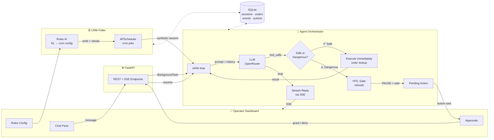
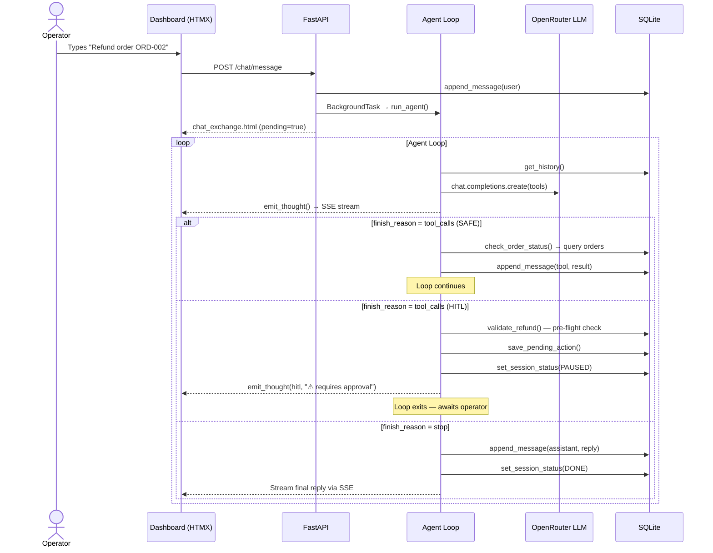
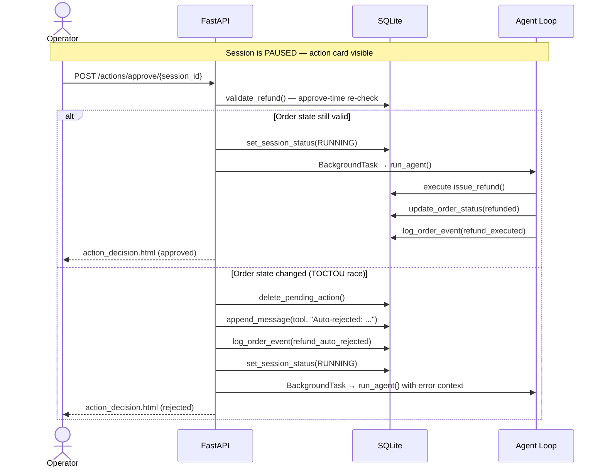
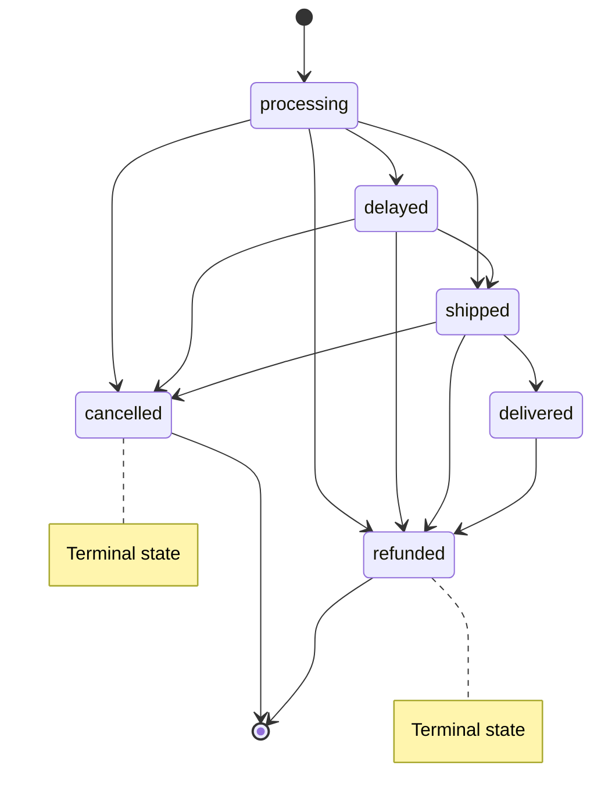

# CustomerClaw — Technical Reference Document

## Project Overview

**CustomerClaw** is a proactive, Human-in-the-Loop customer experience agent
built on FastAPI. An LLM-powered orchestrator handles inbound support chats,
gates irreversible actions (refunds) behind operator approval with TOCTOU race
protection, and proactively reaches out to customers with stale orders via
configurable cron jobs — all without a single agent framework dependency.

The goal is an **"open agent" experience with guardrails**: operators interact
with a flexible LLM that can look up orders, draft messages, and take real
actions — but destructive operations (refunds, cancellations) are gated behind
a human approval step that re-validates state before execution. The operator
gets the power of an unconstrained AI assistant; the business gets an auditable
safety net.

---

## System Architecture

> **Reading the diagram:** A customer message enters from the left, flows through
> FastAPI into the agent's `while` loop. The LLM decides to either call a **safe tool**
> (executes instantly, loops back) or a **dangerous tool** (pauses for human approval).
> The operator approves/denies from the dashboard, and the loop resumes.
> Separately, the **CRM Poller** fires cron jobs that inject synthetic sessions
> into the same agent loop — configurable via the **Rules AI** chat interface.

---

## Core Flows

### 1. Reactive Chat — Customer Requests a Refund

### 2. HITL Approval with TOCTOU Guard

---

## Design Decisions

### No Agent Framework

LangChain, CrewAI, and similar frameworks add significant abstraction over
tool dispatch and state management. When things go wrong — a tool call hangs,
state transitions silently, or the LLM hallucinates a tool name — debugging
requires understanding the framework's internal event loop on top of your own
logic. More fundamentally, frameworks encourage implicit state management
that makes it hard to reason about what the agent *can't* do.

The orchestrator in CustomerClaw is a **40-line `while` loop** with three
explicit code paths: safe tool → execute and loop, dangerous tool → pause and
return, stop → stream reply and exit. Every state transition is a single
`if/elif/else` that you can read top-to-bottom. Adding the HITL gate was a
one-block change — no framework hooks, middleware, or event registration.

What makes this viable without a framework is the **graph-enforced state
machine** below — correctness isn't maintained by convention or hope, it's
structurally enforced at the data layer.

### Graph-Enforced Order State Machine

Order status transitions are not free-form string updates. They are governed
by a **directed graph** (`ORDER_STATUS_GRAPH`) that defines every legal edge
in the system:

`update_order_status()` validates every requested transition against this
graph before writing. Illegal transitions raise `InvalidOrderTransition` —
the system literally **cannot reach an invalid state**, regardless of what
the LLM attempts. This is what allows the agent loop to remain framework-free:
the guardrails live in the data layer, not in orchestration middleware.

This graph also feeds directly into the TOCTOU double-validation (below).
When `validate_refund()` checks whether a refund is allowed, it's asking
whether `current_status → refunded` is a legal edge in this graph. Terminal
states (`cancelled`, `refunded`) have no outbound edges, making double-refunds
and refund-after-cancel **structurally impossible** — not just "the code
checks for it," but the data model rejects it.

### TOCTOU Double-Validation

A naive HITL flow validates the action once (before showing the approval card)
and assumes the world hasn't changed by the time the operator clicks "Grant."
In practice, another agent, a concurrent session, or even the same operator in
a different tab could modify the order state during the approval window.

CustomerClaw validates refunds **twice** using the same `validate_refund()`
function:

1. **Pre-flight** — before entering the HITL gate, to avoid presenting
   approval cards for orders that are already ineligible.
2. **Approve-time** — after the operator clicks Grant, immediately before
   execution. If the order state has drifted (e.g., already refunded), the
   system **auto-rejects**, logs a `refund_auto_rejected` event, and re-enters
   the agent loop with the rejection context so the LLM can inform the
   operator. This makes double-refunds structurally impossible.

### Proactive Outreach via Cron Scheduling

The "proactive" in CustomerClaw is the **CRM Poller** — an APScheduler layer
that runs configurable cron jobs to query the orders table for stale records
and inject *synthetic sessions* into the same agent loop used for reactive
chats.

This means the LLM handles both inbound requests and outbound outreach through
a **single code path** — no duplication of orchestration logic, tool dispatch,
or HITL gating. A proactive outreach session is indistinguishable from a
reactive one at the orchestrator level; the only difference is who initiated it
(cron trigger vs. human message).

Operators configure these cron jobs through **natural language** via the
Rules AI tab. The Rules AI is a second, independent LLM loop with its own tool
set (`list_rules`, `create_or_update_rule`, `delete_rule`, `toggle_rule`) that
writes JSON config files and **hot-reloads** the scheduler — no server restart
required. This is effectively a natural-language meta-programming layer over
the scheduling infrastructure.

### Atomic HITL Gate

The HITL gate uses a **compare-and-swap** on session status to prevent
double-approvals from concurrent clicks. When an operator clicks "Grant,"
the endpoint checks that the session is still `PAUSED` before flipping it
to `RUNNING`. If two tabs click simultaneously, only the first one succeeds;
the second sees `RUNNING` and short-circuits. Pending actions are keyed by
session ID, ensuring at most one action is in flight per session at any time.

### SSE Dual-Path Rendering

The event log panel uses two rendering paths that converge into a single
timeline format (`etl-row`):

- **Live path** — during an agent run, events stream via SSE and are prepended
  to the timeline in real time.
- **Reload path** — on page load or session switch, events are loaded from the
  database and rendered into the same HTML structure.

Both paths share the same partial templates, ensuring visual consistency. This
also means the event log functions as a **built-in audit trail** — every LLM
call, tool execution, and HITL decision is persisted and queryable.

### Server-Rendered UI (HTMX over SPA)

The entire UI is server-rendered HTML fragments delivered via HTMX — no React,
no Vue, no client-side state management. Every UI update (chat bubbles,
approval cards, event log entries) is a Jinja2 template rendered on the server
and swapped into the DOM. This eliminates an entire class of bugs around
client-server state sync and keeps the frontend zero-dependency.

---

## Tech Stack

| Layer | Technology | Why |
|---|---|---|
| **Frontend** | Jinja2 + HTMX | Server-rendered HTML fragments, zero JS framework overhead |
| **Real-time** | SSE (sse-starlette) | Simpler than WebSockets; HTMX handles reconnect natively |
| **Backend** | FastAPI | Async-first, BackgroundTasks for agent dispatch |
| **LLM** | OpenAI SDK → OpenRouter | Model-agnostic; swap models via settings without code changes |
| **Orchestrator** | Plain `while` loop | No framework — full control over tool dispatch and HITL gating |
| **State** | SQLite | Single-file DB for sessions, HITL queue, orders, event log |
| **Scheduler** | APScheduler (AsyncIO) | Cron-based proactive outreach, hot-reloadable from Rules AI |
| **Deployment** | Uvicorn | ASGI server with `--reload` for dev |

---

## Production Considerations

This is a portfolio project running on SQLite with mock data, but the
architecture was designed with real-world constraints in mind. Here's what a
production deployment would look like:

- **Database** — SQLite is a single-writer bottleneck. A production version
  would swap in **PostgreSQL** with row-level locking on the HITL gate
  (compare-and-swap becomes `SELECT ... FOR UPDATE`). The database layer is
  already abstracted behind helper functions, so this is a swap, not a
  rewrite.

- **Backpressure** — If 1,000 stale orders fire simultaneously from a cron
  job, the current implementation spawns 1,000 concurrent `run_agent()` tasks.
  A production system would use a **task queue** (Celery, Dramatiq) with
  configurable concurrency limits and retry policies.

- **Observability** — The event log dual-path (SSE live + DB reload) is
  essentially a structured audit trail. In production, this would feed into
  a proper observability stack (structured logging → ELK/Datadog) with
  alerting on HITL timeouts and auto-rejection rates.

- **Multi-tenancy** — Sessions are currently keyed by UUID. Supporting
  multiple operators on the same system would require tenant isolation on
  sessions, RBAC on approval actions, and per-tenant LLM usage tracking.

- **Channel Abstraction** — The system already supports `web` and `telegram`
  channels via a channel field on sessions. Adding WhatsApp, Slack, or email
  would require implementing each channel's inbound webhook and outbound
  client, but the core agent loop remains unchanged.
