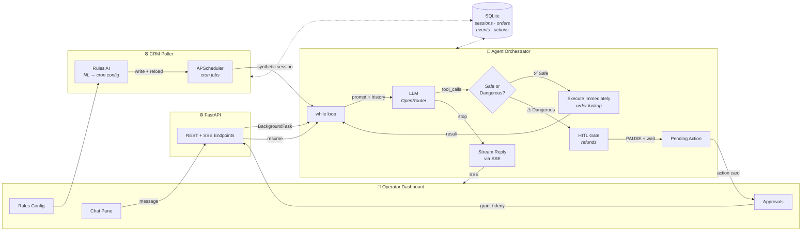
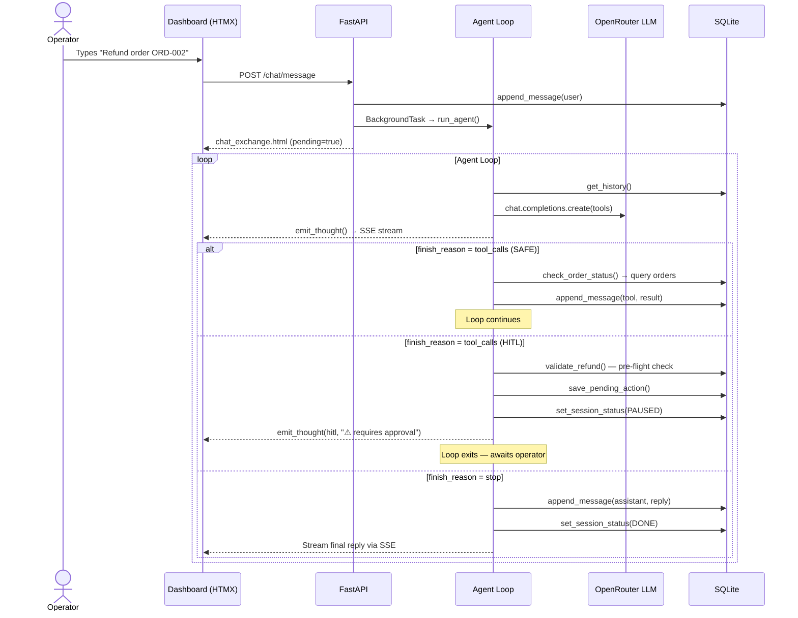
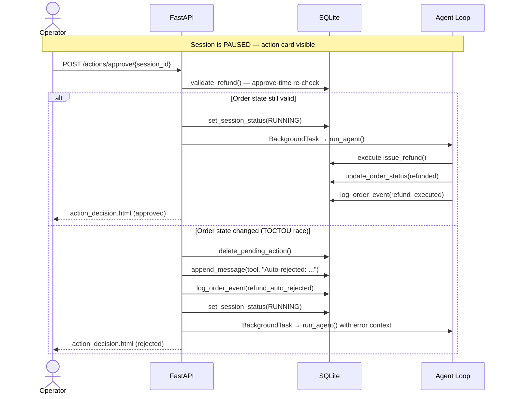
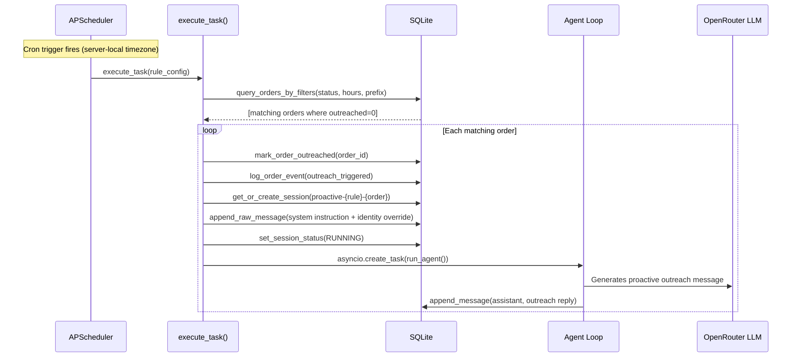
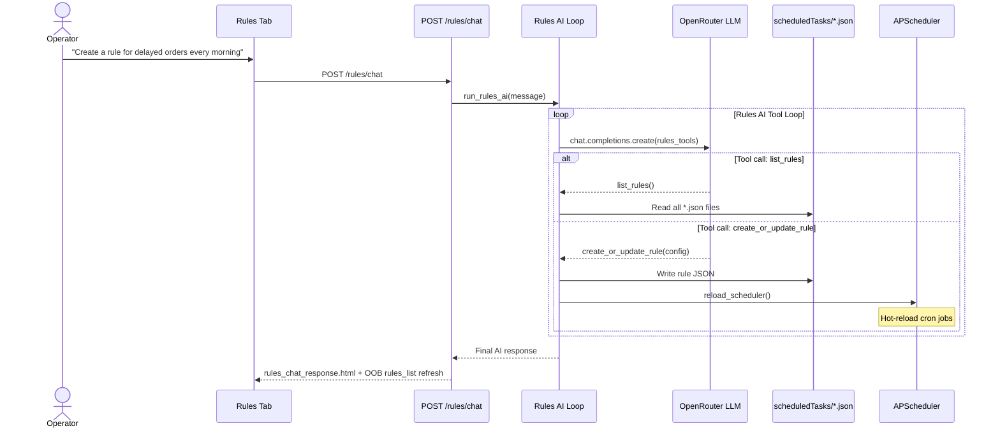
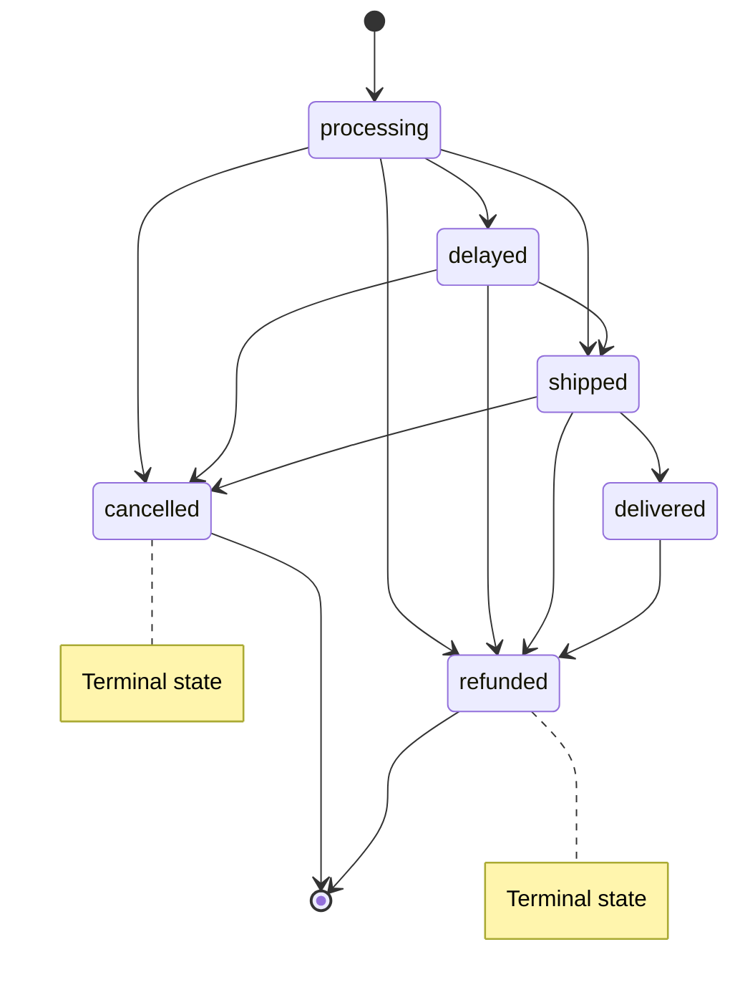

# CustomerClaw — Technical Reference Document

## System Architecture

> **Reading the diagram:** A customer message enters from the left, flows through
> FastAPI into the agent's `while` loop. The LLM decides to either call a **safe tool**
> (executes instantly, loops back) or a **dangerous tool** (pauses for human approval).
> The operator approves/denies from the dashboard, and the loop resumes.
> Separately, the **CRM Poller** fires cron jobs that inject synthetic sessions
> into the same agent loop — configurable via the **Rules AI** chat interface.

## Core Flows

### 1. Reactive Chat — Customer Requests a Refund

### 2. HITL Approval with TOCTOU Guard

### 3. Proactive Outreach via CRM Poller

### 4. Rules AI — Natural Language Rule Configuration

## Order Status State Machine

## Tech Stack

| Layer | Technology | Why |
|---|---|---|
| **Frontend** | Jinja2 + HTMX | Server-rendered HTML fragments, zero JS framework overhead |
| **Real-time** | SSE (sse-starlette) | Simpler than WebSockets; HTMX handles reconnect natively |
| **Backend** | FastAPI | Async-first, BackgroundTasks for agent dispatch |
| **LLM** | OpenAI SDK → OpenRouter | Model-agnostic; swap models via settings without code changes |
| **Orchestrator** | Plain `while` loop | No framework — full control over tool dispatch and HITL gating |
| **State** | SQLite | Single-file DB for sessions, HITL queue, orders, event log |
| **Scheduler** | APScheduler (AsyncIO) | Cron-based proactive outreach, hot-reloadable from Rules AI |
| **Deployment** | Uvicorn | ASGI server with `--reload` for dev |

## Key Design Decisions

- **No agent framework** — the orchestrator is a 40-line `while` loop with explicit tool dispatch, not a LangChain/CrewAI abstraction. Every state transition is visible and debuggable.
- **Double-validation pattern** — refunds are validated both pre-flight (before HITL gate) and at approve-time (after operator clicks Grant) to prevent TOCTOU races.
- **Atomic HITL gate** — compare-and-swap on session status prevents double-approvals from concurrent clicks.
- **SSE dual-path rendering** — live events stream via SSE during agent runs; persisted events load from DB on page reload. Both converge into the same timeline format.
- **Rules AI as a meta-layer** — operators configure cron jobs through natural language, which writes JSON files and hot-reloads the scheduler. No restarts needed.
